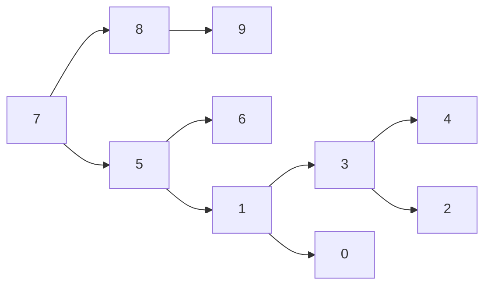

# Binary Search Tree Projesi

### [7,5,1,8,3,6,0,9,4,2] dizisinin Binary-Search Tree aşamalarını yazınız.

```mermaid
graph LR
A["7"] --> B[8]
A --> C[5]
B --> D[9]
C --> E[6]
C --> F[1]
F --> G[3]
G --> H[4]
G --> I[2]
F --> J[0]
```
